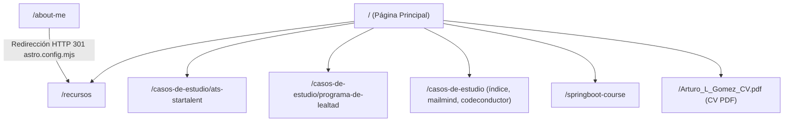

# Especificación de Diseño (DESIGN.md)

Este documento define el sistema de diseño, la arquitectura visual, los componentes primitivos y las guías de estilo para la plataforma personal y portafolio profesional de **Arturo L. Gómez** (`lgzarturo_cv`).

---

## 1. Visión General y Filosofía de Diseño

El diseño web del sitio combina **estética profesional de alto nivel** (Glassmorphism, dark mode nativo, paletas armónicas HSL/Hex por tecnología) con **rendimiento web extremo** gracias a la arquitectura basada en **Astro 6** e Islas de React.

### Principios Fundamentales
1. **Claridad Técnica y Jerarquía Visual**: Uso de contenedores definidos, tarjetas elevadas, distintivos (badges) temáticos y código ASCII/mono para diagramas técnicos.
2. **Experiencia Fluida e Interactiva**: Micro-animaciones (transformaciones al posar el cursor, contadores animados mediante `IntersectionObserver`, menús flotantes glassmorphism).
3. **Soporte Nativo Claro / Oscuro**: Cambio de tema basado en clases (`.dark` en `<html>`) persistido en `localStorage` con fallbacks automáticos según las preferencias del sistema (`prefers-color-scheme`).
4. **Enfoque Responsivo & Mobile First**: Adaptación fluida mediante `@tailwindcss/vite` (Tailwind CSS v4) y `<picture>` responsivo con soporte para imágenes WebP y PNG.

---

## 2. Tecnologías y Librerías Core

| Tecnología | Versión | Rol en el Sistema |
| :--- | :--- | :--- |
| **Astro** | `^6.1.3` | Framework estático principal, SSR/SSG, enrutamiento y componentes de maquetación |
| **Tailwind CSS** | `^4.1.13` | Motor de estilos de utilidades importado vía `@tailwindcss/vite` |
| **React** | `^5.0.2` (`@astrojs/react`) | Integración instalada, sin islas activas: `Quote` ahora es `Quote.astro` y no se envía runtime de React |
| **@tailwindcss/typography** | `^0.5.18` | Plugin para estilos tipográficos en contenidos extensos |
| **@astrojs/sitemap** | `^3.7.2` | Generación automática de mapas del sitio XML |

---

## 3. Sistema de Colores y Tokens Visuales

### 3.1 Colores Base y Fondos

- **Modo Claro**:
  - Fondo general: `#FFFFFF` / `bg-gray-50` / `bg-gray-100`
  - Texto principal: `text-gray-900` (`#111827`)
  - Texto secundario: `text-gray-600` (`#4B5563`)
- **Modo Oscuro**:
  - Fondo general: `dark:bg-gray-900` / `dark:bg-gray-950`
  - Texto principal: `dark:text-gray-100` / `dark:text-white`
  - Texto secundario: `dark:text-gray-400` / `dark:text-gray-300`
- **Acentos e Identidad Principal**:
  - Azul Primario: `from-blue-600 to-purple-600`
  - Gradiente Hero: `from-blue-500 via-purple-500 to-pink-500`

### 3.2 Tokens de Tecnología (Variables CSS en `src/styles/global.css`)

Cada tecnología desplegada en los badges y tarjetas del sitio posee un par cromático de fondo de bajo contraste (`100`) y texto/borde de alto contraste (`800`), con soporte de inversión automática en `.dark`:

```css
:root {
  --color-java-100: #F7E1B3;       --color-java-800: #B07219;
  --color-spring-100: #D3F9D8;     --color-spring-800: #6DB33F;
  --color-python-100: #f0ffe8;     --color-python-800: #63e546;
  --color-micro-100: #D0E6FF;      --color-micro-800: #1565C0;
  --color-nextjs-100: #EAEAEA;     --color-nextjs-800: #000000;
  --color-devops-100: #E0E7FF;     --color-devops-800: #4338CA;
  --color-seo-100: #F5F5F5;        --color-seo-800: #616161;
  --color-grails-100: #F3E8FF;     --color-grails-800: #6E4C13;
  --color-aws-100: #FFF7E1;        --color-aws-800: #FF9900;
  --color-mysql-100: #E0F7FA;      --color-mysql-800: #00758F;
  --color-vps-100: #F5F5F5;        --color-vps-800: #616161;
  --color-js-100: #FFF9C4;         --color-js-800: #F7DF1E;
  --color-postgresql-100: #E3F2FD; --color-postgresql-800: #336791;
  --color-php-100: #EDE9FE;        --color-php-800: #777BB4;
  --color-vb-100: #F3E8FF;         --color-vb-800: #68217A;
  --color-servers-100: #E0E7FF;    --color-servers-800: #1E293B;
  --color-astro-100: #F5F3FF;      --color-astro-800: #6C2BD7;
  --color-markdown-100: #F7F7F7;   --color-markdown-800: #404040;
  --color-webp-100: #E0F7FA;       --color-webp-800: #009688;
  --color-html-100: #FFE5E0;       --color-html-800: #E44D26;
  --color-css-100: #E0F0FF;        --color-css-800: #264DE4;
  --color-kotlin-100: #EDE9FE;     --color-kotlin-800: #7F52FF;
}
```


### 3.3 Pares de badge y contraste

Los colores de marca `--color-*-100/800` se conservan como referencia, pero **lo que se pinta** son los pares `--tech-*-bg` / `--tech-*-fg` de `global.css`, calculados para cumplir **contraste ≥ 4.5:1 (WCAG AA)** en claro (`:root`) y oscuro (`.dark`). Las clases `bg-[tech]-100` y `text-[tech]-800` se mantienen como nombres de uso, así que el marcado no cambia. Al agregar una tecnología, verificar el contraste del par antes de registrarla.

---

## 4. Tipografía y Estilos de Texto

- **Familia Tipográfica Primaria**: `Inter`, sans-serif (cargada mediante Google Fonts con los pesos 300, 400, 500, 600 y 700).
- **Código y Diagramas**: Font stack monoespaciado nativo (`font-mono`) en tarjetas de arquitecturas y bloques de código.

### Jerarquía de Encabezados

- **H1 Principal (Hero)**: `text-4xl md:text-5xl font-extrabold leading-tight tracking-tight text-white`
- **H1 de páginas internas (casos)**: `text-4xl md:text-5xl font-extrabold leading-tight text-gray-900 dark:text-white`
- **H2 Título de Sección** (primitivos de sección): `text-2xl md:text-3xl font-bold tracking-tight text-gray-900 dark:text-white`
- **H3 Título de Tarjeta / Módulo**: `text-xl` a `text-2xl font-bold text-gray-900`
- **Párrafos de Cuerpo**: `text-lg leading-relaxed text-gray-600 dark:text-gray-300`
- **Tamaño mínimo de texto**: 12px (`text-xs`); no usar tamaños menores.

---

## 5. Animaciones y Micro-interacciones (`global.css`)

Animaciones en uso (definidas en `global.css` o de Tailwind):

1. **`animate-fade-in`**: entrada de secciones al hacer scroll. La aplica `public/script.js` solo a las secciones que están debajo del primer viewport (clase transitoria `.js-reveal` con `opacity: 0`). No actúa con `prefers-reduced-motion`; sin JS el contenido queda visible. `springboot-course` usa su propio reveal (`.reveal` / `.in`, activo solo con `@media (scripting: enabled)`).
2. **`animate-pulse-slow`**: indicador de disponibilidad y estado activo.
3. **`animate-pop-scale-and-rotate-15`**: escala `1.15` y rotación `-15deg` al pasar el cursor sobre los distintivos de experiencia.
4. **`animate-pop`**: pulso breve de escala.
5. **`animate-bounce`** (Tailwind): flecha del hero.

Definidas pero **sin uso actual**: `animate-rotate-grow`, `animate-gradient-text`, `animate-bounce-subtle`, `animate-slide-up`, `animate-slide-down`, `animate-bounce-slow`, `animate-fade-in-delay`. Candidatas a eliminar.

`@media (prefers-reduced-motion: reduce)` desactiva animaciones y transiciones y el scroll suave en todo el sitio.

---

## 6. Arquitectura de Componentes

### 6.1 Layout Base: `BaseLayout.astro`
- **Ubicación**: `src/layouts/BaseLayout.astro`
- **Responsabilidad**:
  - Renderiza el HTML esqueleto con etiquetas `<head>`, metaetiquetas SEO (Open Graph, Twitter Cards), favicon y esquema JSON-LD (`Person`).
  - Carga el archivo `src/styles/global.css`.
  - Ejecuta el script inline contra parpadeos (FOUC) para sincronizar el tema claro/oscuro desde `localStorage` y `matchMedia`. Los textos de los botones de tema salen de `data-dark` / `data-light` en el marcado; `aria-pressed` se actualiza al cambiar.
  - Incluye el enlace "Saltar al contenido" (`#main`, visible al recibir foco). Cada página expone `<main id="main">`.
  - Inyecta opcionalmente **Google Tag Manager** si la variable de entorno `VITE_GTM_ID` está configurada.

### 6.2 Encabezado Navegable: `Header.astro`
- **Ubicación**: `src/components/Header.astro`
- **Características**:
  - **Fijo y traslúcido**: `fixed top-0 z-50 w-full border-b border-gray-200 bg-white/85 backdrop-blur-md dark:border-gray-800 dark:bg-gray-950/85`.
  - **Identidad**: insignia estática `ALG` (bloque azul `bg-blue-600`) más el título, enlazados a `/`.
  - **Navegación** (igual en todas las páginas): `Sobre Mí`, `Laboratorio`, `Experiencia` (anclas de `/`), `Recursos`, `Casos` y botón destacado `Contacto`.
  - **Página actual**: `aria-current="page"` en `Recursos` y `Casos` (incluye subrutas), con estilo azul.
  - **Tema**: botón con texto en escritorio y solo icono (🌙/☀️, 40×40 px) en móvil, con `aria-pressed` y nombre accesible.
  - **Menú móvil**: lista desplegable bajo la barra; se cierra al elegir un enlace o con Escape, y devuelve el foco al botón.
  - Objetivos táctiles de 40×40 px en los botones del header.

### 6.3 Pie de Página: `Footer.astro`
- **Ubicación**: `src/components/Footer.astro`
- **Estilo**: Oscuro constante (`bg-gray-900 text-gray-300 dark:bg-black dark:text-gray-400`).
- **Contenido**: navegación secundaria, correo, Blog, GitHub, LinkedIn, derechos reservados y lema. Muestra `Quote` solo con `showQuote`.

### 6.4 Primitivos de Sección Layout

1. **`SectionColumn.astro`**:
   - Layout de 2 columnas responsivas (`md:grid-cols-2`).
   - Acepta slots para contenido principal y slot nombrado `content`.
2. **`SectionRow.astro`**:
   - Sección centrada de fondo oscuro `bg-gray-900 text-white dark:bg-black` (`max-w-4xl`).
   - Utilizada para métricas de alto impacto (e.g. bloque de usuarios migrados y tiempos operativos).
3. **`SectionTitle.astro`**:
   - Estructura estándar con título alineado a la izquierda (`max-w-3xl`) y slot nombrado `content` para grillas inferiores.

### 6.5 Frase aleatoria: `Quote.astro`
- **Ubicación**: `src/components/Quote.astro`
- **Tipo**: componente Astro sin hidratación. El servidor pinta una frase al compilar y un script mínimo la reemplaza por otra en cada visita.
- **Uso**: `<Quote />` desde `Footer.astro` cuando `showQuote` es verdadero.

---

## 7. Estructura de Páginas y Flujo de Navegación


```mermaid
graph TD
    A["/ (Página Principal)"] --> B["/recursos"]
    A --> C["/casos-de-estudio/ats-startalent"]
    A --> D["/casos-de-estudio/programa-de-lealtad"]
    A --> G["/casos-de-estudio (índice, mailmind, codeconductor)"]
    A --> H["/springboot-course"]
    A --> E["/Arturo_L_Gomez_CV.pdf (CV PDF)"]
    F["/about-me"] -->|Redirección HTTP 301 astro.config.mjs| B
```

### 7.1 Página Principal (`/` - `src/pages/index.astro`)
- **Hero Section**: Imagen de fondo responsiva `<picture>` (`beautiful-cancun-large.webp` / `beautiful-cancun-half.webp`) con filtro de brillo.
- **Sección Sobre Mí**: Tarjeta interactiva con imagen dual claro/oscuro (`arturo-lopez-day.png` y `arturo-lopez-night.png`), insignia flotante `15+` años.
- **Sección Impacto**: Contadores numéricos que se incrementan progresivamente al ser visibles en pantalla (`IntersectionObserver`).
- **Sección Filosofía de Liderazgo**: Grilla de 3 tarjetas sobre Arquitectura Pragmática, Calidad & Entrega y Cultura/Mentoring.
- **Laboratorio de Ideas**: Proyectos destacados con enlaces directos y badges por tecnología.
- **Experiencia Profesional (Timeline)**: Nodos verticales interactivos ordenados cronológicamente (`#lider-tecnico`, `#arquitecto-software`, etc.).
- **Notas del Blog**: el RSS XML de `arthurolg.com` se consulta con `fetch` en tiempo de compilación (frontmatter); si falla, la sección se omite.
- **Imágenes**: los `<source>` de la foto de "Sobre mí" usan las versiones WebP generadas con `getImage()` (antes servían los PNG originales de más de 1 MB). La foto del hero lleva `fetchpriority="high"` y la de "Sobre mí" `loading="lazy"`.

### 7.2 Página de Recursos (`/recursos` - `src/pages/recursos.astro`)
- **Sección de Recursos y Notas**: Tarjetas de accesos directos a repositorios de GitHub (`learning-resources`, `practice-examples`, `productividad`, `notes`, etc.).
- **Radar Tecnológico**: Matriz dividida en **Core (Adopción)**, **Trial (Exploración)** y **Hold (Mantenimiento)**.
- **Proyectos en Marcha**: Catálogo de side projects (`cotizador`, `faro-vault`, `devtools`, `miraeljuego`, etc.).

### 7.2b Curso Spring Boot (`/springboot-course` - `src/pages/springboot-course.astro`)
- Identidad visual propia (tipografías Pixelify Sans y JetBrains Mono, paleta retro con variables `--bg`, `--text`, etc. y modo oscuro neón) mediante `<style is:global>` acotado a esta ruta. Solo `body` y `#hero-title` son selectores genéricos.
- Usa el Header y el Footer comunes; su contenido va en `<main id="main" class="course-page">`.

### 7.3 Casos de Estudio (`src/pages/casos-de-estudio/*.astro`)
- **`ats-startalent.astro`**: Rediseño del ATS StarTalent (SaaS multi-tenant con Grails y MySQL).
- **`programa-de-lealtad.astro`**: Migración del Programa de Lealtad a microservicios en AWS ECS con Spring Boot y Kotlin.
- **`mailmind.astro`** y **`codeconductor.astro`**: casos de MailMind y del framework CodeConductor.
- **`index.astro`**: hub que lista los casos.
- **Diseño de los Casos**:
  - Breadcrumbs de navegación superior.
  - Bloque destacado de métricas de impacto principales.
  - Secciones estructuradas: *01 El Reto*, *02 La Arquitectura*, *03 El Impacto*.
  - Diagramas visuales en contenedor `bg-gray-950` estilo consola terminal/monoespaciado.
  - Cajas de lecciones clave y badges de stack utilizado.

---

## 8. Guía de Recursos Gráficos y Multimedia

- **Imágenes Responsivas de Personaje**:
  - `src/assets/images/arturo-lopez-day.png`
  - `src/assets/images/arturo-lopez-night.png`
- **Fondos del Hero**:
  - `src/assets/images/beautiful-cancun-large.webp` (pantallas `>= 1024px`)
  - `src/assets/images/beautiful-cancun-half.webp` (pantallas `< 1023px`)
- **Documento CV PDF**:
  - `public/Arturo_L_Gomez_CV.pdf`

---

## 9. Convenciones de Desarrollo y Mantenimiento

1. **Estilos de Commit**: Seguir estrictamente la convención documentada en las reglas del repositorio (`<tipo>(<scope>): <descripción corta>`) en **español neutro**, encabezado de máximo 69 caracteres, en modo imperativo o infinitivo.
2. **Modo Oscuro**: Al incorporar nuevas tarjetas o componentes, siempre incluir las variantes `dark:bg-*` y `dark:text-*`.
3. **Nuevas Tecnologías**: Si se agregan nuevas tecnologías al sitio, definir sus tokens `--color-[tech]-100` y `--color-[tech]-800` y el par `--tech-[tech]-bg` / `--tech-[tech]-fg` (claro y oscuro, contraste ≥ 4.5:1) en `global.css`, y registrar sus clases `bg-[tech]-100` y `text-[tech]-800`.
4. **Imágenes**: usar `<Image>` / `getImage()` de `astro:assets`. No apuntar `srcset` a `imported.src` de PNG/JPG originales.

---

## 10. Accesibilidad y Verificación

- **Contraste**: texto ≥ 4.5:1 (badges con pares `--tech-*`; en el footer, `gray-400` sobre `gray-900`).
- **Teclado**: enlace "Saltar al contenido", anillo de foco visible en los controles del header, menú móvil con Escape.
- **Objetivos táctiles**: mínimo 24 px (WCAG 2.5.8); enlaces de texto sueltos con `min-h-7` o `py-1`.
- **Movimiento**: respetar `prefers-reduced-motion`; no ocultar contenido sin respaldo si falta JS.
- **Modo oscuro**: toda clase de fondo, texto o borde claro necesita su variante `dark:` (p. ej. `bg-gray-50 dark:bg-gray-900`, `text-blue-600 dark:text-blue-400`). Dentro de cajas siempre oscuras (diagramas en `bg-gray-950`, hero, CTA) usar directamente el tono claro, sin `dark:`. Los botones blancos sobre fondos de color (CTA) no llevan `dark:bg-*`.
- **Contraste automático**: `axe-core` (regla `color-contrast`) sobre las 8 rutas en claro y oscuro debe dar 0 fallos. Único falso positivo conocido: `#participa-titulo` en `/springboot-course` en oscuro, porque axe cuenta el `text-shadow` neón como fondo.
- **Verificación**: sin desborde horizontal a 360, 768 y 1280 px, en claro y oscuro, en todas las rutas. Medido con Chromium (Playwright) tras el pulido de octubre de 2026.
